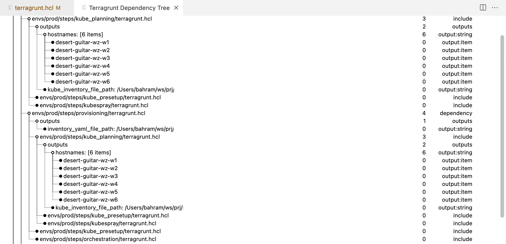

# Terragrunt HCL Parser

A powerful and efficient parser for Terragrunt HCL (HashiCorp Configuration Language) files. This library provides convenience features and tools for parsing and analyzing Terragrunt configuration files. The parser is available as an npm package that can be integrated into your projects.

[](https://www.npmjs.com/package/tghclparser)
[](https://www.npmjs.com/package/tghclparser)
[](LICENSE)

This parser is under active development and new features are being added regularly. Please report any issues or feature requests in the [GitHub repository](https://github.com/jowharshamshiri/tghclparser/issues). 🚀🚀🚀

If you found this helpful, consider supporting my work with a [tip](https://ko-fi.com/jowharshamshiri). Your support helps me create more quality tools.

## Features

### Terragrunt.hcl Dependency Tree

Visualize the dependency tree of Terragrunt configuration files 🚀
Display output variables in the dependency tree 🚀


### Configuration Parsing

- Real-time error detection and diagnostics
- Incremental document parsing for better performance
- Complete HCL syntax parsing and validation
- Document link processing for dependencies

### Variable Processing

- Context-aware configuration analysis
- Comprehensive variable scope handling
- Locals and variables parsing 🚀
- Output variables processing based on terraform state 🚀

### Document Management

- Full support for configuration lifecycle
- Maintains parsed document state for quick access
- Workspace-aware configuration support

### Error Reporting

- Detailed diagnostic messages for syntax and semantic errors
- Comprehensive error information

### Performance

- Incremental configuration synchronization
- Efficient caching of parsed documents
- Optimized for large files and frequent updates

## Installation

1. Install via npm:

   ```
   npm install terragrunt-hcl-parser
   ```

2. Or clone this repository:

   ```
   git clone https://github.com/jowharshamshiri/tghclparser.git
   ```

3. Navigate to the project directory:

   ```
   cd tghclparser
   ```

4. Install dependencies:

   ```
   npm install
   ```

## Usage

```typescript
import { HoverProvider, CompletionsProvider, DiagnosticsProvider, ParsedDocument, Workspace, Token } from 'tghclparser';

// Initialize workspace
const workspace = new Workspace();

// Read documents
const parsedDocument = new ParsedDocument(workspace, document.uri, document.getText());
parsedDocuments.set(document.uri, parsedDocument);

await workspace.addDocument(parsedDocument);

const diagnostics = parsedDocument.getDiagnostics();
const hoverResult = await parsedDocument.getHoverInfo({
 line: 21,
 character: 42,
});
const completions = await parsedDocument.getCompletions({
 line: 21,
 character: 42,
});

```

## Contributing

Contributions are welcome! Please feel free to submit a Pull Request.

## License

This project is licensed under the MIT License - see the [LICENSE](LICENSE) file for details.

## Acknowledgments

- Thanks to the Terragrunt community for inspiration and use cases. Special thanks to rtizzy on github for reminding me to build this parser. Also thanks to and-win, gsouf, lucalooz, jonath92 for filing issues and feature requests.
